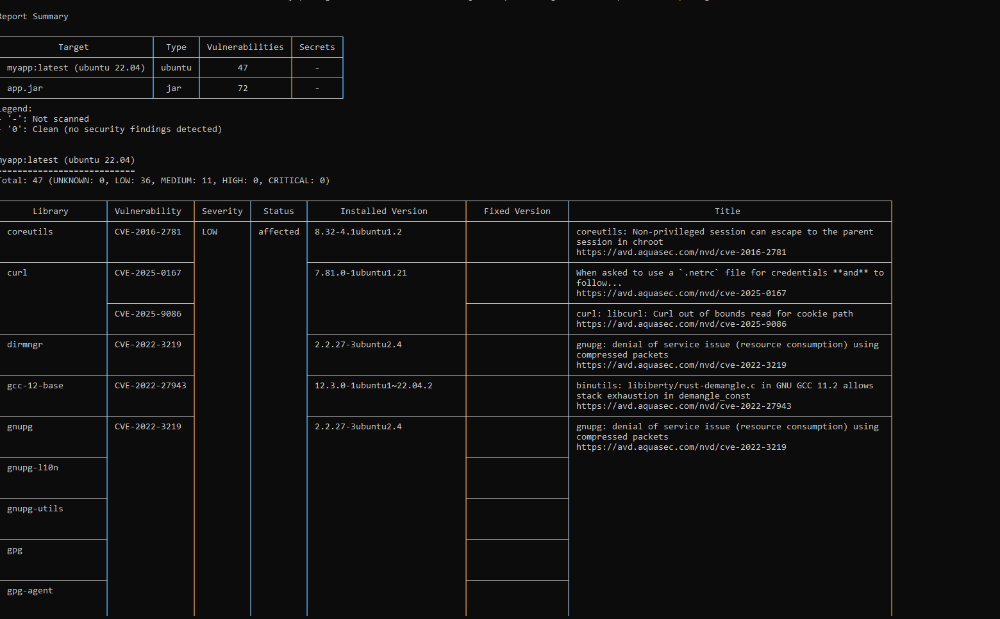
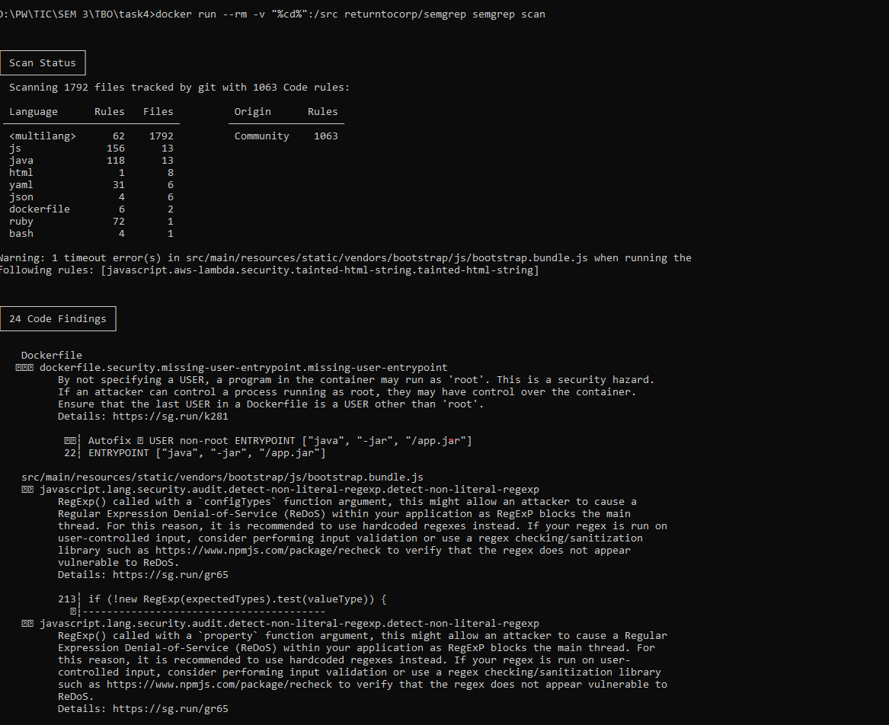
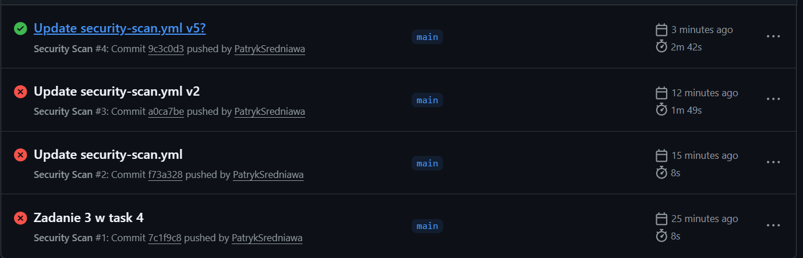

## Zad 1: Trivy na lokalnie zbudowanym obrazie Dockera

Po uruchomieniu aplikacji w dockerze otrzymujemy:

## Zad2: SAST z wykorzystaniem Semgrep
Po uruchomieniu aplikacji w dockerze otrzymujemy:

## Zad 3: Przygotowanie procesu CI/CD z wykorzystaniem Trivy i Semgrep

W ramach zadania stworzono plik security-scan.yml. Sporo prób było nieudanych z różnych powodów. Najpierw Trivy, następnie Semgrep.

Ostatecznie udało się:

Link do zadania, gdzie są wyniki testów:
https://github.com/PatrykSredniawa/task4/actions/runs/20244296967/job/58120214389

## Zadanie 4: ## Uruchomienie aplikacji lokalnie + DAST z wykorzystaniem ZAP

Wykryto szereg podatności takie jak:
- Absensce of anti-CSRF tokens
- Content Security Policy (CSP) Header Not Set
- Missing Anti-clickjacking header
i wiele wiele innych.

Pokazuje to zalety skanowania dynamicznego. Umożliwia wykrycie podatności, które można ominąc w skanowaniu statycznym bądź je po prostu nie wykryć. 
Każde z użytych narzędzi koncentruje się na innym obszarze, przez co wyniki mogą się różnić. 
Analiza z użyciem Trivy wykryła podatności związane z bibliotekami Java, wiele z nich miało wysokie ryzyko. 
Natomiast analiza dynamiczna z użyciem ZAP umożliwiło wykrycie błędów przede wszystkim konfiguracyjncyh. 
Sprawdza przede wszystkim zachowanie aplikacji zamiast samego kodu.